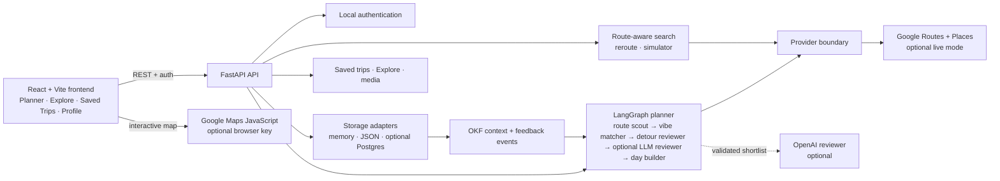

<p align="center">
  
</p>

## Codex Hackathon Project

VibeTrip is a working MVP for an agentic road-trip planner designed around Singaporean exchange students. It reduces the cognitive load of planning a road trip by combining route geometry, practical breaks, personal preferences, and route-aware place recommendations:

1. Add a starting point and destination.
2. Set the trip context (dates, group size, budget).
3. Review an agent-produced route, detours, buffers, and timeline.
4. Adjust stops and refine the travel profile.
5. Save, complete, and optionally publish trips with photos or videos to Explore.

## How Codex accelerated development

VibeTrip was developed iteratively in Codex, using GPT-5.6 as the coding and
reasoning model for product, design, and engineering decisions. Codex turned
user research observations, screenshots, and bug reports into working changes
across the React frontend, FastAPI backend, LangGraph workflow, persistence
layer, and README. The app's optional runtime LLM configuration is separate
from this development workflow and can be disabled for deterministic demo
mode.

### Skills and workflow used

- **UI/UX Pro Max:** used to review screenshots and improve information
  hierarchy, responsive layout, accessibility, focus states, form feedback,
  loading states, map interactions, timeline affordances, saved-trip actions,
  media previews, and Explore navigation.
- **Bug Journal:** maintained a persistent record of non-trivial failures with
  their symptom, root cause, fix, and one prevention rule. This made recurring
  issues—such as route waypoint ordering, checkpoint-preserving Explore reuse,
  missing Fastest fuel stops, map marker interactions, and billable API
  request limits—available as regression guidance during later changes.
- **Graphify:** indexed the repository as a local, queryable knowledge graph
  so Codex could trace relationships across the frontend, FastAPI backend,
  route graph, providers, storage adapters, and SQL schema before opening the
  smallest relevant set of files.

For the repository-navigation workflow, install Graphify once, register its
Codex skill, and build or refresh the local index:

```bash
pip install "graphifyy[sql]"
graphify install --platform codex
```

```text
/graphify .
/graphify . --update
```

The generated `graphify-out/` directory is a local index containing the graph,
interactive visualization, and architecture report; it is ignored by Git.

### Key product and engineering decisions

- Route geometry, waypoint order, opening hours, budget, and safety constraints
  remain deterministic.
- The optional LLM adds subjective ranking and explanation only after hard
  feasibility filtering; it cannot invent places or route data.
- OKF is a derived agent-readable context artifact, not a replacement for the
  database.
- A vector store is deferred until saved-place discovery or semantic
  trip-history retrieval actually requires one.
- Google Maps, Places, and OpenAI remain optional so the project is still
  demonstrable in deterministic demo mode, while live capabilities can be
  enabled independently.

## Architecture overview

The high-level flow keeps the browser focused on interaction, the FastAPI
boundary responsible for validation and orchestration, and deterministic route
checks authoritative over optional provider and LLM suggestions.



## Run the frontend locally

```bash
npm install
npm run dev
```

## Run the planner API

For judging, copy the template and paste the provided demo keys into `.env`.
Keep this file local; it is ignored by Git.

```dotenv
GOOGLE_MAPS_API_KEY=<provided-google-server-key>
VIBETRIP_LIVE_MAPS_ENABLED=true

VITE_GOOGLE_MAPS_BROWSER_ENABLED=true
VITE_GOOGLE_MAPS_BROWSER_KEY=<provided-google-browser-key>
VITE_GOOGLE_MAPS_MAP_ID=<provided-google-map-id-or-DEMO_MAP_ID>

OPENAI_API_KEY=<provided-openai-key>
VIBETRIP_LLM_ENABLED=true
VIBETRIP_LLM_SEARCH_ENABLED=true
VIBETRIP_LLM_MODEL=gpt-4o-mini

VITE_API_URL=http://localhost:8000
VIBETRIP_AUTH_SECRET=vibetrip-local-development-secret
```

```bash
python3 -m venv .venv
source .venv/bin/activate
pip install -r requirements.txt
cp .env.example .env
# Edit .env with the provided keys above.
uvicorn backend.main:app --reload --port 8000 --env-file .env
```

Open a second terminal for the frontend:

```bash
npm install
npm run dev
```

Docker is optional and not required for the judged local MVP flow. The app uses
local auth, process memory, and browser `localStorage` fallbacks when no
database is running.

The API exposes `GET /health`, `POST /trips/plan`, `POST /trips/reroute`, and
`POST /trips/search`, `POST /trips/save`, `GET /trips/saved`,
`DELETE /trips/saved/{id}`, `POST /trips/saved/{id}/complete`,
`PATCH /trips/saved/{id}/visibility`, `POST /trips/saved/{id}/media`, and
`GET /trips/explore`, plus `POST /profiles/okf` for a private agent context
artifact and `POST /profiles/events` for explicit route feedback. Authentication is provided by `POST /auth/signup`, `POST /auth/login`,
`POST /auth/logout`, `GET /auth/me`, and `PATCH /auth/me`.
The frontend calls the planner from `src/App.jsx` and falls back to a local
preview when FastAPI is not running, so the UI remains usable without API keys.
The browser routes are `/login`, `/onboarding`, `/plan`, `/explore`,
`/saved-trips`, and `/profile`. Unauthenticated visitors are sent to `/login`;
the first successful sign-in for an account opens `/onboarding` so they can set
their travel preferences before entering the planner. Completing onboarding is
stored per account in the browser, and the preferences can be changed later
from the account menu’s Travel profile page.

### Demo mode versus live mode

The repository is designed to remain judgeable without paid provider keys:

- **Demo mode:** omit Google and OpenAI keys. The deterministic provider returns
  seeded route/place data and the UI remains fully navigable.
- **Live map mode:** explicitly set `VIBETRIP_LIVE_MAPS_ENABLED=true`, provide
  `GOOGLE_MAPS_API_KEY` for the backend Routes + Places calls, and provide
  `VITE_GOOGLE_MAPS_BROWSER_ENABLED=true` plus
  `VITE_GOOGLE_MAPS_BROWSER_KEY` for the browser map. Restrict the browser key
  by HTTP referrer and restrict the server key by API and quota.
- **LLM review and route requests:** provide `OPENAI_API_KEY` and keep
  `VIBETRIP_LLM_ENABLED=true`. `VIBETRIP_LLM_SEARCH_ENABLED=true` lets the
  route assistant parse conversational requests into a concise Maps query,
  while the backend still enforces explicit locality, checkpoint ordering,
  opening hours, and budget constraints deterministically. The LLM may rank
  or interpret requests, but it cannot invent places or override geography.
- **Cost guard:** live autocomplete waits for three characters, debounces
  requests, uses one Places session token per field interaction, and applies a
  per-client rolling-minute limit controlled by
  `VIBETRIP_AUTOCOMPLETE_MAX_PER_MINUTE` (default `20`). Broad place searches
  request ranking/scheduling fields only; review text is intentionally deferred.
  Nearby categories are batched into one search per sampled route point instead
  of one request per category.
  The backend also applies process-local circuit breakers to Routes, Places
  search, and Place Details (defaults `10`, `30`, and `20` requests per minute)
  and falls back to demo data when a limit is reached. Lower these values for a
  live demo, and still configure Google Cloud quotas because these guards reset
  when the backend process restarts.
- **Hard off switch:** set `VIBETRIP_LIVE_MAPS_ENABLED=false` to force the
  deterministic demo provider even if a Google key remains in `.env`.

### Demo account and fallback mode

No separate seed script is required for judging. On first API startup, the
local auth adapter creates the demo account shown below. If Google Maps keys
are provided, the planner uses live Routes and Places results. If keys are
omitted, the deterministic provider supplies fallback route geometry, route
candidates, fuel stops, destination suggestions, and Explore examples so the
planner can still be exercised end to end. Saved drafts fall back to process
memory and browser `localStorage` in the judged local flow.

Never put `GOOGLE_MAPS_API_KEY` or `OPENAI_API_KEY` in a `VITE_*` variable or
commit them to Git. Google Maps usage requires billing, so set quota and budget
alerts before enabling live mode.

### Environment variables

Copy `.env.example` to `.env` and configure only what the chosen mode needs:

| Variable | Required | Purpose |
| --- | --- | --- |
| `GOOGLE_MAPS_API_KEY` | Live mode | Backend Routes and Places requests |
| `VIBETRIP_LIVE_MAPS_ENABLED` | Live mode | Explicitly enables billable backend Maps calls |
| `VITE_GOOGLE_MAPS_BROWSER_KEY` | Live mode | Interactive browser map |
| `VITE_GOOGLE_MAPS_BROWSER_ENABLED` | Live mode | Explicitly enables billable browser map loads |
| `OPENAI_API_KEY` | Optional | LLM recommendation reviewer |
| `VIBETRIP_LLM_SEARCH_ENABLED` | Optional | LLM parser for route assistant requests |
| `VIBETRIP_LLM_SEARCH_MAX_PER_MINUTE` | Optional | Process-local route assistant LLM limit |
| `VITE_API_URL` | Deployment | Public backend URL used by the frontend |
| `VIBETRIP_AUTH_SECRET` | Deployment | Secret used to sign session cookies |
| `DATABASE_URL` | Optional | Postgres adapter connection string |
| `VIBETRIP_MEDIA_DIR` | Optional | Local media storage directory |
| `VIBETRIP_OKF_DIR` | Optional | Local OKF profile directory |
| `VIBETRIP_AUTOCOMPLETE_MAX_PER_MINUTE` | Live mode | Per-client autocomplete safety limit |
| `VIBETRIP_GOOGLE_ROUTES_MAX_PER_MINUTE` | Live mode | Process-local Routes circuit breaker |
| `VIBETRIP_GOOGLE_PLACES_MAX_PER_MINUTE` | Live mode | Process-local Places search circuit breaker |
| `VIBETRIP_GOOGLE_DETAILS_MAX_PER_MINUTE` | Live mode | Process-local Place Details circuit breaker |

`VITE_*` values are bundled into the browser and are not secret. The server
variables must remain backend-only.

## Verification checklist

Run these checks before opening a pull request or recording the demo:

```bash
npm run build
python3 -m compileall -q backend
git diff --check
```

Then manually verify the primary journey:

1. Create an account or use the demo login.
2. Complete onboarding and confirm the name and travel profile are reflected in
   the planner.
3. Generate a route with dates, start time, travellers, budget, and route style.
4. Replace one stop through the route assistant and confirm the route is
   recalculated through the replacement waypoint in the correct order.
5. Add an optional destination stop and verify the timeline and route update.
6. Save the trip, mark it complete, add media, publish it, and find it through
   Explore search, filters, and pagination.
7. Test logout/login, a second account, keyboard focus, mobile layout, and the
   no-API-key demo fallback.

The current repository has no automated test suite yet, so the manual journey
above is an important pre-submission check.

## Saved trips and Explore

Saved drafts use a small repository boundary in `backend/storage.py`. For the
judged local MVP, the API can fall back to process memory and the browser also
keeps local-preview saves in `localStorage`, so Postgres is not required to run
or demonstrate the core flow. A Postgres adapter exists as future persistence
work, and the local Compose service can be started with:

```bash
docker compose up -d postgres
```

The MVP uses the authenticated user ID as the owner. The user profile is
intentionally lightweight: display name and home base are stored with the local
account, while “exchange student” is the only planning context needed.
Saved trips are private drafts by default. A user can mark a draft completed,
attach memories, and publish it; Explore only includes trips that are both
`is_public` and `is_completed`. The feed ranks public routes using preference
overlap and adventure-level distance. Explore also has a local search bar for
published trip ideas and route-style filters; this does not call Google Places.
Live place discovery stays inside the planner’s route assistant, where a search
can be constrained to the selected route segment before making a provider call.

### Memories and media

Completed trips can accept JPG, PNG, WebP, GIF, MP4, WebM, and MOV uploads up to
20 MB through `POST /trips/saved/{id}/media`. The local MVP stores files under
`backend/media/` and returns stable `/media/...` URLs. Set `VIBETRIP_MEDIA_DIR`
to use another local directory. This adapter is deliberately isolated so it
can be replaced with S3, Cloudflare R2, or another sharable object store later
without changing the trip or Explore response shape. Media is never required:
routes without memories use a generated route cover in the UI.

### Local authentication

The judging build uses a self-contained local auth adapter, so no Supabase or
other hosted identity project is required. User records are stored in the
private, Git-ignored `backend/auth_users.json`; passwords are scrypt-hashed and
the API sets a signed HttpOnly session cookie. The first API startup seeds the
demo account:

```text
Email: demo@vibetrip.local
Password: vibetrip-demo
```

New accounts receive unique IDs, and those IDs namespace saved trips and OKF
profile documents. Set `VIBETRIP_AUTH_SECRET` in `.env` outside demo mode. This
adapter is intentionally replaceable with managed authentication before
production deployment.

### OKF agent context

`POST /profiles/okf` exports a private, versioned OKF-style Markdown context
document for the authenticated traveller. It combines the current profile,
the user's saved trip history, and explicit route feedback stored in the
`trip_events` table. The planner refreshes this artifact automatically before
each route generation, passes the structured context through LangGraph, and
includes it in the optional LLM reviewer prompt. The document is context, not
authority: route geometry, opening hours, waypoint ordering, and budget checks
remain deterministic. Local files are written to `backend/okf_profiles/` and
ignored by Git; set `VIBETRIP_OKF_DIR` to use another private directory or
replace the adapter with an object-store/knowledge-catalog writer later.

The frontend records meaningful feedback such as replacing a stop, removing a
stop, using an Explore route, and searching for a better fit through
`POST /profiles/events`. On the next generation, the context builder turns
those events into soft signals such as local food, quieter stops, scenic views,
or budget-conscious choices. This is the value of OKF plus the database: the
agent receives a compact, human-readable preference memory derived from real
trip behaviour without adding a vector store to the MVP.

With `GOOGLE_MAPS_API_KEY`, the backend calls the current Google Routes API to
get a driving route and samples its polyline to search nearby tourist
attractions, cafes, restaurants, and fuel stops with the Places API. Candidates
are scored inside the LangGraph detour reviewer using rating, review count,
price level, opening status, estimated crowd risk, enjoyment, and detour time.
The map UI shows the top candidates as route markers and the planner exposes
`POST /trips/simulate` to test a closure, crowd spike, or late-running event.

`POST /trips/search` powers the route-request assistant. It accepts a
natural-language request such as “a quiet cafe with a view” and, when replacing
an existing timeline stop, searches only the geographic segment between the
previous and next checkpoints. Results are ordered by route progress near the
selected stop before enjoyment scoring is used as a tie-break. The MVP does not need a vector store for
this live discovery flow: Google Places handles free-form place search, while
LangGraph remains responsible for route fit and itinerary decisions. A vector
store becomes useful later for persistent user taste, saved places, and
trip-history retrieval.

`POST /trips/reroute` is used after a user adds, removes, or replaces a stop.
It sends the edited places as ordered route waypoints so the map geometry is
recomputed through the actual stops instead of leaving them as nearby markers.

Google's public Places fields provide ratings, review counts, price levels, and
opening hours; they do not provide a guaranteed live crowd count. The MVP
therefore labels crowding as an estimate and lets the simulator explicitly
invalidate a stop. If you choose a free OSM stack later, use a hosted provider
or self-host Nominatim/Overpass rather than sending production traffic to the
public endpoints without following their usage and attribution policies.

## Product / agent direction

The planner is a small, typed LangGraph workflow supported by route, Places,
simulation, and persistence services. The current graph has five nodes; the
route-request assistant is a separate route-aware search capability. The fifth
node is optional: it calls an LLM only when configured and otherwise preserves
the deterministic recommendation result.

### What each planner agent does

1. **Route scout (`route_scout`)**
   - Establishes the baseline driving route between the origin and destination.
   - Supplies distance, drive time, traffic-aware estimates, route geometry, and
     the corridor used to discover nearby places.
   - Keeps destination-area recommendations separate from places that are
     genuinely along the route.

2. **Vibe matcher (`vibe_matcher`)**
   - Converts the travel profile into a lightweight archetype such as
     “Curious, not rushed” or “Easygoing explorer.”
   - Combines explicit preferences, adventure-slider level, group size,
     saved-trip history, and learned feedback signals from the OKF context.
   - Sets planning defaults such as the buffer allowance and recommendation
     balance; it does not change the road geometry.

3. **Detour reviewer (`detour_reviewer`)**
   - Scores candidate attractions, eateries, cafes, fuel stations, and
     convenience stores.
   - Weighs rating quality, review volume, price, estimated crowd risk,
     enjoyment, opening hours, detour time, route style, adventure level, and
     the traveller's learned soft preferences.
   - Selects the best along-route candidates for the current route mode:
     `fastest` keeps only essentials and at least one fuel stop, `balanced` allows worthwhile detours,
     and `scenic` allows more intermediate experiences.

4. **LLM recommendation reviewer (`llm_reviewer`)**
   - Receives only a shortlist that has already passed deterministic route and
     availability checks.
   - Interprets the user's structured profile and route context, ranks
     subjective fit, and returns candidate IDs plus a short rationale using
     structured output.
   - Cannot invent places, coordinates, prices, reviews, opening hours, or
     route geometry. If the key is missing or the call fails, the graph keeps
     the deterministic reviewer result.

5. **Day builder (`day_builder`)**
   - Converts selected places into an ordered, time-aware itinerary.
   - Adds practical fuel, bathroom, snack, and convenience stops where the
     drive length warrants them; it does not invent “stop anywhere” breaks.
   - Uses route progress as the ordering key, checks regular opening hours at
     the estimated arrival time, and reserves driving, stop, and contingency
     buffers before check-in.

### Supporting route agents and services

- **Route-request assistant (`POST /trips/search`)** translates a natural-
  language request such as “quiet Chinese food under my budget” into a focused
  Places search along the current route. It returns replacement candidates for
  the selected timeline stop; it does not replace every stop at once.
- **Reroute service (`POST /trips/reroute`)** turns a user’s add, change, or
  remove action into ordered waypoint coordinates and asks the route provider
  to recompute the geometry through those actual places.
- **Trip simulator (`POST /trips/simulate`)** applies a closure, crowd spike,
  or late-running event to one current stop, then chooses a feasible backup or
  sends the group directly onward.
- **Destination explorer** keeps post-arrival ideas optional until the user
  selects “Add to route.” That action promotes the place into the active
  itinerary before check-in and triggers the same reroute service.

The end-to-end graph is:

```text
route_scout → vibe_matcher → detour_reviewer → llm_reviewer → day_builder
                                                   ↓
                                      ordered itinerary + route constraints
```

Route style and travel profile are intentionally separate inputs. `fastest`,
`balanced`, and `scenic` control route geometry and how many detours the day
builder may add. The adventure slider only changes recommendation scoring and
the inferred archetype within that route strategy.

The current FastAPI boundary exposes a synchronous `POST /trips/plan` endpoint
and keeps planner state typed and serializable so drafts can be saved and
resumed. Streaming agent progress remains a future enhancement.

## Deploying the MVP

For a hosted demo, deploy the Vite frontend and FastAPI backend separately. Set
`VITE_API_URL` to the public backend URL before building the frontend, and set
the backend's `VIBETRIP_AUTH_SECRET` to a long random value. A hosted Postgres
instance is recommended for saved trips; the default local JSON, memory, and
filesystem adapters are intended for judging and local development, not
durable production storage.

Uploaded memories also need persistent object storage or a persistent volume in
deployment. The current media adapter writes to `backend/media/`, so ephemeral
hosting will lose uploads after a restart. Replace it with S3, Cloudflare R2,
or another sharable object store before treating the app as production-ready.

Before publishing a repository or demo, confirm that `.env`, API keys, local
auth data, OKF artifacts, media, and database volumes are not committed. The
repository's `.gitignore` excludes these local state files.
